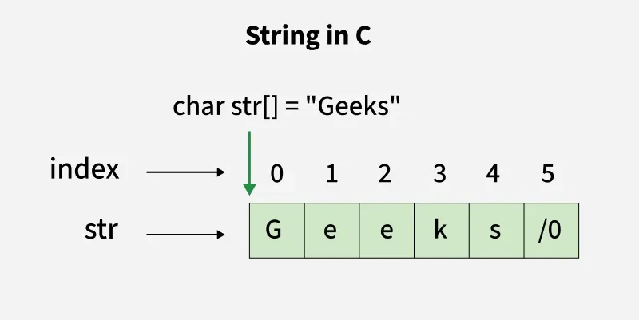
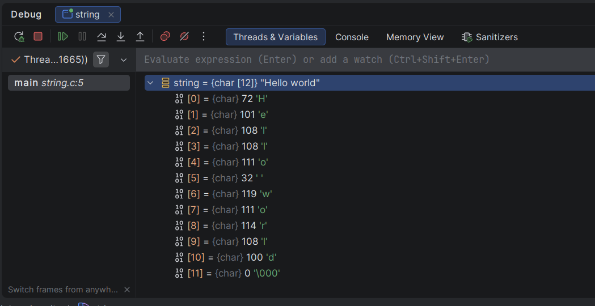
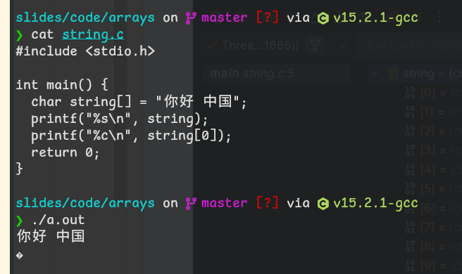
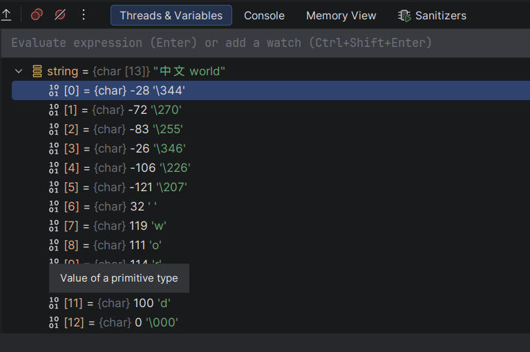

# 字符串 (string)

但是，实际上C语言中并没有一个具体的字符串类型，字符串实际上指的是字符的数组，这是一个相当粗糙的实现，且仅支持ASCII码



---



---



---



---

# 一些关于C字符串的函数

主文件 <string.h>

|函数签名|描述|
|:---|:---|
|char * strcat(char * __dest, char * __src)|拼接字符串String Concat|
|int strcmp(char * __s1, char * __s2)|字符串比较String Compare|
|char * strcpy(char * __dest, char * __src)|字符串复制String Copy|
|size_t strlen(const char *__s)|字符串长度String Length|
|char *strncat (char *__dest, char * __src, size_t __n)|字符串按字符数复制String Concat with N|

---

# Examples

``` c
#include <stdio.h>
#include <string.h>

int main() {
    char dest[100] = "Hello";
    char src[] = " World";
    
    printf("strcat: %s\n", strcat(dest, src));
    
    char s1[] = "abc";
    char s2[] = "abd";
    printf("strcmp: %d\n", strcmp(s1, s2));
    
    char dest2[100];
    strcpy(dest2, "Copy this");
    printf("strcpy: %s\n", dest2);
    
    printf("strlen: %zu\n", strlen("Test string"));
    
    char dest3[100] = "Start";
    strncat(dest3, " and more text", 5);
    printf("strncat: %s\n", dest3);
    
    return 0;
}
```

---

# C++中的string

``` c++
#include <iostream>
#include <string>

int main() {
  std::string s;
  std::cin >> s;
  std::cout << s;
  return 0;
}


