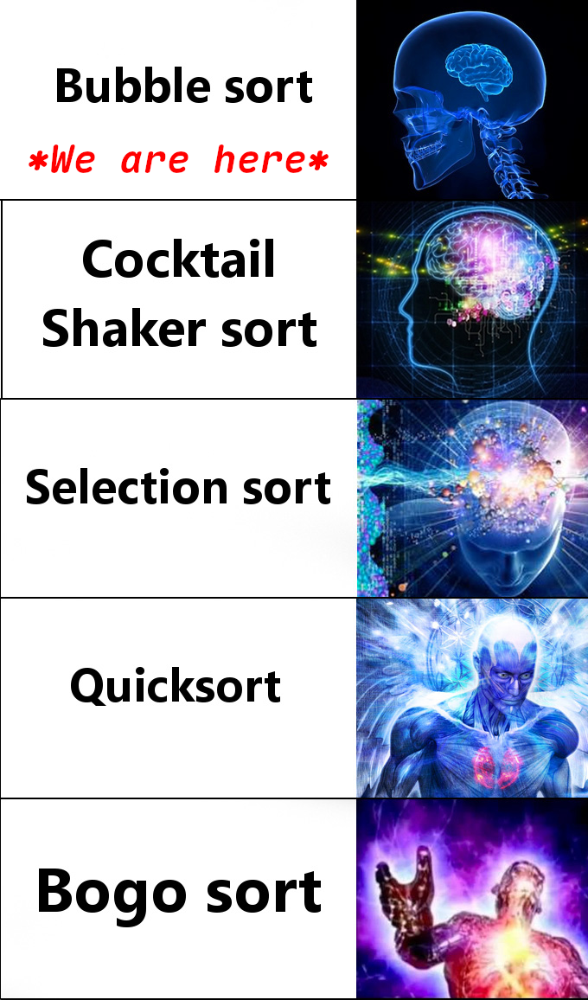
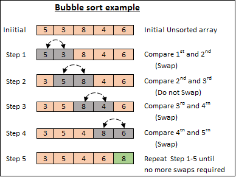

# 冒泡排序

> Static visualization of bubble sort
>
> *from Wikipedia*


---

# 冒泡排序

冒泡排序（Bubble Sort）是排序算法中最简单的排序算法，取名为冒泡排序是因为较小的元素会经由交换慢慢“浮”到数列的顶端。

常用于向初入程序设计的学生介绍算法的概念（正如现在）

- 时间复杂度：$O(n^2)$
- 空间复杂度：$O(1)$



---



0. 待排序的数组 $arr[n]\vert_{n=5}$
1. $arr[0] > arr[1] \to \text{swap}$
2. $arr[1] > arr[2] \to \text{no swap}$
3. $arr[2] > arr[3] \to \text{swap}$
4. $arr[3] > arr[4] \to \text{swap}$
5. 一轮交换结束

重复 1-5 步 n-1 次或直到不再需要交换

---

##### Implementation

``` c
#include <stdbool.h>

void bubble_sort(int arr[], int n) {
  for (int i = 0; i < n - 1; i++) {
    bool swapped = false;
    for (int j = 0; j < n - i - 1; j++) {
      if (arr[j] > arr[j + 1]) {
        swapped = true;
        _swap(&arr[j], &arr[j + 1]); // roll your swap impl based on pointer knowledge
      }
    }

    if (!swapped) {
      break;
    }
  }
}
```

---

## Further more

- [Learn Bubble Sort in 7 minutes :diving_mask:](https://www.youtube.com/watch?v=Dv4qLJcxus8) by BroCodez @ Youtube
- [Bubble Sort](https://www.youtube.com/watch?v=Cq7SMsQBEUw&list=RDCq7SMsQBEUw) by TimoBingmann @ Youtube
- [Bubble sort animation showing why it's bubble](https://upload.wikimedia.org/wikipedia/commons/3/37/Bubble_sort_animation.gif) from Wikipedia
