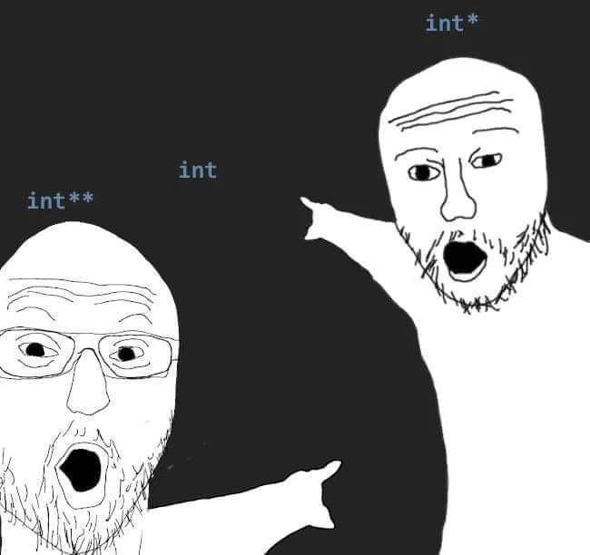
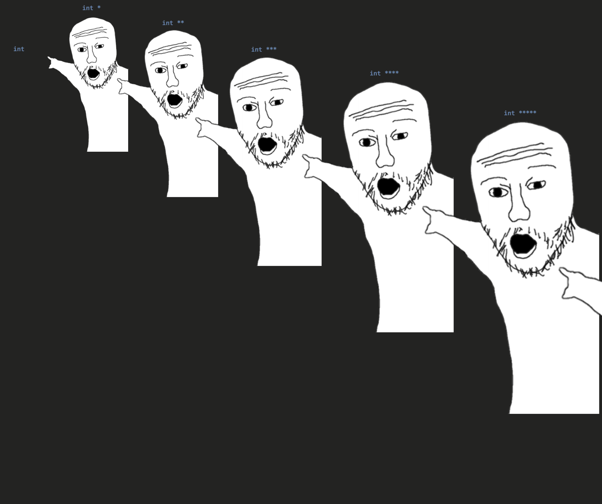
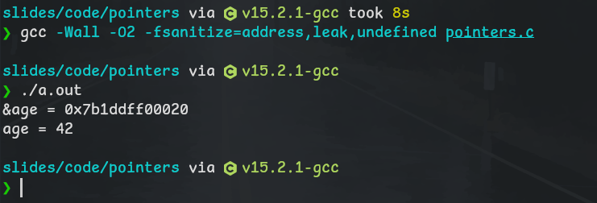
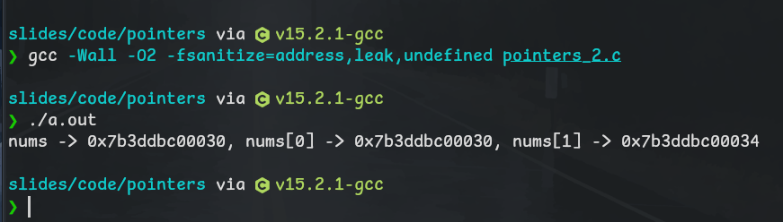

## 指针 Pointers

<style scoped>
table {
    table-layout: fixed;
    width: 100%;
}

img {
    mix-blend-mode: ;
}
</style>

指针（Pointer），是用来存储内存地址的变量。指针变量的值直接指向（points to）存在该地址的对象的值。

||||
|:---:|:---:|:---:|
||||

---


内存是计算机内存储数据的连续线性空间，其基础单元是字节。每个字节有独一编号，称为地址。程序使用的变量就是存储在这样的内存中。

常规变量在内存中即为变量本身，指针变量内容为指向另一个变量在内存中的地址。

如图，`a`为指针，指向内存地址`1008`存储的变量`b`。

---

## 程序演示

``` c
#include <stdio.h>

int main() {
    int age = 42;     // Answer to everything
    int *pAge = &age; // Recommended
    // int* pAge = &age;
    // int * pAge = &age;
    // int*pAge = &age;    // Most cursed one among all
    // What ever the fuck, not recommended

    printf("&age = %p\n", pAge); // %p means printing in pointer way
    printf("age = %d\n", *pAge); // dereferencing a pointer

    return 0;
}
```

---

## 程序演示




---

## 指针主要用处 - 用于传递可变引用

``` c
#include <stdio.h>

void increment(int a) {
    // x's value is passed into function instead of x itself
    a++;
}

int main() {
    int x = 1;
    increment(x);
    // so x will not be changed after function call
    printf("x = %d\n", x);    // x = 1
    return 0;
}
```

---

## 指针主要用处 - 用于传递可变引用

``` c
#include <stdio.h>

void increment(int *a) {
    // address of x is passed into function,
    // dereferencing it to make changes to the object the address pointing to, 
    // instead of the address
    (*a)++;
}

int main() {
    int x = 1;
    increment(&x);
    // x is changed
    printf("x = %d\n", x);    // x = 2
    return 0;
}
```

---

## 指针主要用处 - 用于传递可变引用

``` c
int a;
scanf("%d", &a);
```

---

## 关于数组与指针

数组实质上是指向一片连续内存空间中第一个单元的地址的指针。

``` c
#include <stdio.h>

int main() {
    int nums[10];
    printf("nums -> %p, nums[0] -> %p, nums[1] -> %p\n", 
        nums, &(nums[0]), &(nums[1]));
    return 0;
}
```

---

## 关于数组与指针



---

## 关于函数与指针

``` c
#include <stdio.h>

int add(int a, int b) {
    return a + b;
}

int main() {
    int (*func)(int, int);
    func = &add;
    printf("func(1, 2) = %d\n", func(1, 2)); // Implicitly dereferencing
    printf("func(1, 2) = %d\n", (*func)(1, 2)); // Explicitly dereferencing
    return 0;
}
```

---

## Further more

[you will never ask about pointers again after watching this video (LowLevelTV @ Youtube)](https://www.youtube.com/watch?v=2ybLD6_2gKM)

[C pointers explained (BroCodez @ Youtube)](https://www.youtube.com/watch?v=DplxIq0mc_Y)

[Explain pointers until I go insane (Mults @ Youtube)](https://www.youtube.com/watch?v=qclZUQYZTzg)

